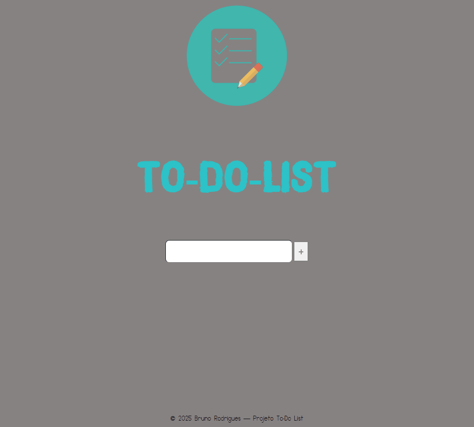

# To-Do-List 📋

#### Esse é meu segundo projeto, no qual me eventurei em criar um design do zero e adicionar algumas funcionalidades.
#### Se trata de um to-do-list para gerenciar tarefas. Com ele você pode:
#### -Criar Tarefas
#### -Marcar Tarefas Concluídas
#### -Remover apenas Tarefas Concluídas
#### -Limpar a Lista de Tarefas

# Meus maiores desafios nesse projeto foram:
#### -Estilização sem uso de display Flex.
#### -Ocultar os Botões de Remoção de Item ou All List, dependendo da Estrutura Condicional.
#### -Adicionar Funcionalidade na Remoção apenas dos itens 'checked'.

[]

# Tecnologias Utilizadas:
- HTML
- CSS
- JS  

#
(https://thedevbrun0.github.io/to-do-list/)